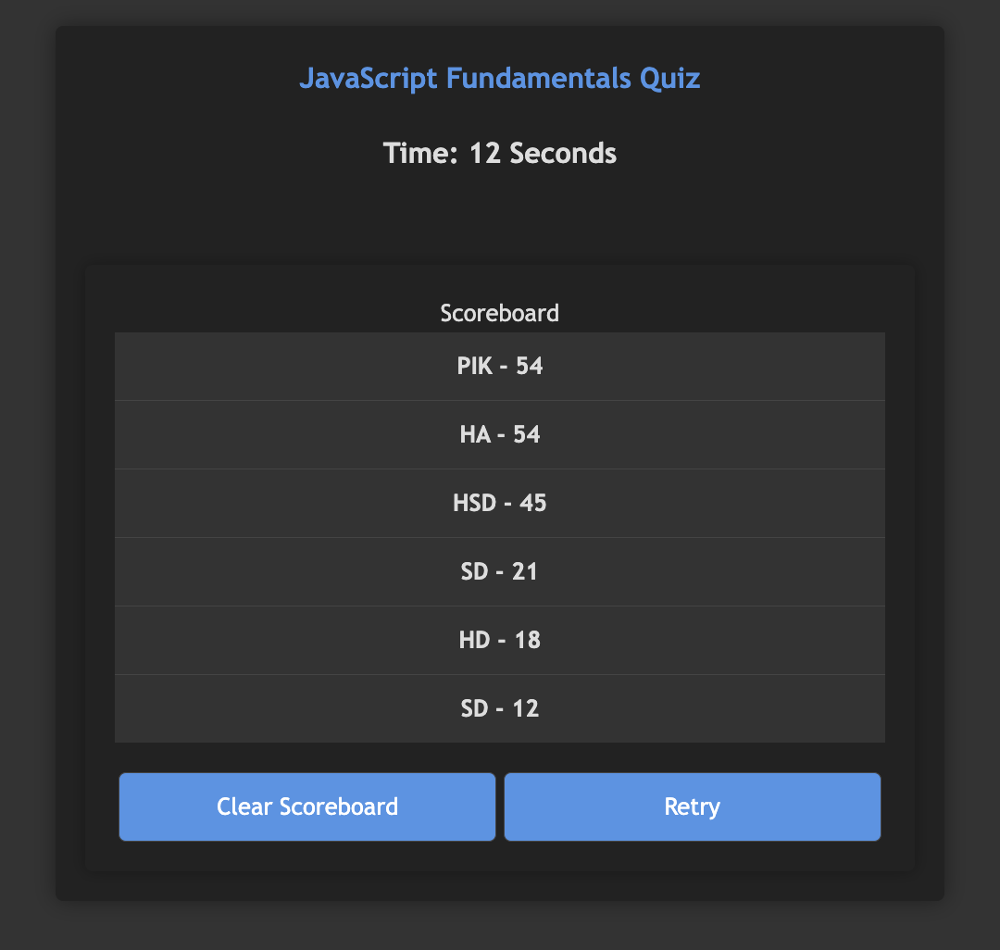

# Timed-JS-Quiz

## Description
This repository contains a simple, interactive JavaScript quiz game designed to test a user's knowledge of JavaScript fundamentals. The main functionality of the quiz includes a countdown timer, a series of multiple-choice questions, and immediate feedback for each answer. Users navigate through the quiz, and time penalties are applied for incorrect answers, impacting the final score which reflects the remaining time. Scores are stored in the browser's local storage, allowing users to keep track of high scores over time. The quiz is styled with CSS for a user-friendly interface and is fully executable in a web browser.

## Snapshot

